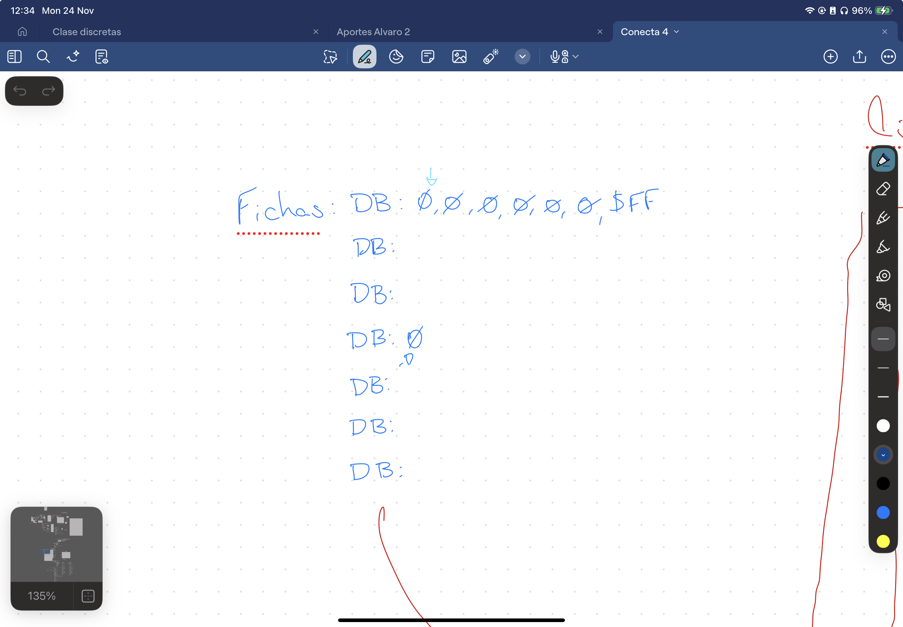

# Proyecto conecta "CUATRO" (q no 3 eh) 
#### Integrantes: Nia Andrade, Vittorio Perillo Piza y Darío Rodriguez

# Cosas a realizar en la entrega 1:
### DONE. Dibujar Pantalla Inicial:  
- [x] Dibujito Conecta 4  
- [x] Preguntar por partida de forma funcional. (TODO redirigir)  
- [x] mostrar mensaje de adios si no se quiere jugar.  
### DONE. Dibujar el tablero (6x7)
- [X] fichas de 2x3
### Dibujar la ficha Inicial
- [x] 1ºcolumna 1ºcolor
- [ ] Hacer bien la ficha con el color del jugador
- [x] lee que pulsamos W o Q
- [ ] mover la pieza derecha (W) e izquierda (Q)
- [x] enter -> ficha del 2º jugador (distinto color) / enter alterna entre jugadores
- [x] F -> simula fin de la partida
### DONE. Dibujar Pantalla Final:
- [x] mostrar mensaje de fin de partida
- [x] preguntar si quiere otra partida de forma funcional (en caso de que si inicializar la siguiente partida) (TODO redirigir)

# Cosas a realizar en la entrega 2:

## Cosas que tenemos que hacer, por prioridas
- [ ] Implementar la ficha
- [ ] Hacer que cambie de color
- [ ] Toda la logica con base en Mannin 
- [ ] Arreglar la dteccion de teclas
- [ ] Implementar la tabla en codigo: 
- [ ] Hacer que compruebe si puede bajar una casilla
- [ ] Funcion de bajar la ficha 